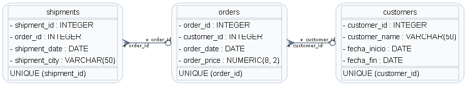

# Humai Data Science Bootcamp Exercises

	

	<b>Practice repository from my Humai Data Scientist Bootcamp.</b> 
	Real exercises to build technical skills for a junior data role.

	
	
	

## About this repo

This repository contains my bootcamp exercises, notebooks, and small projects.
I used it to practice data analysis, Python development, SQL, and clean code habits.

## What I learned

- Data analysis with Pandas: grouping, aggregation, pivot tables, joins, indexing, and data quality checks.
- Data visualization with Matplotlib/Seaborn style workflows in notebooks.
- SQL practice: queries, async exercises, and NoSQL basics with MongoDB.
- Python best practices: type hints (pyhints), logging, testing basics, and project structure.
- Code quality tools: pylint and readable, maintainable code standards.
- Development workflow: Git branches, commits, pull-request style work, and version control discipline.
- Environment and packaging basics: Poetry, virtual environments, and dependency management.
- Intro tools for production mindset: Docker basics and FastAPI introduction.

## Repository topics

- Ciencia de datos: wrangling, visualization, pivot/indexing, quality, and exam notebooks.
- Desarrollo con Python: CLI, typing, pylint, docs, poetry, logging, and exercises.
- Python Avanzado: OOP, testing, CI basics, concurrency, and FastAPI intro.
- SQL / SQL NEW: SQL I & II exercises, MongoDB practice, and guided solutions.

## Why this is important for work

These exercises helped me build a strong base in:

- analytical thinking,
- cleaner code,
- reproducible workflows,
- and team-ready Git practices.

I am ready to keep learning in a real data team.

## Author

**Gustavo Nicolas Castellon**

- GitHub: [ichbinzeed](https://github.com/ichbinzeed)
- LinkedIn: [gustavo-nicolas-castellon](https://www.linkedin.com/in/ichbinzeed)
